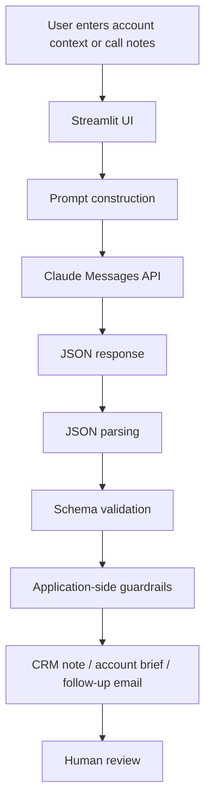

# Architecture

## High-level flow

## Responsibility split

### Claude
- interprets account context and call notes
- proposes hypotheses and discovery questions
- summarizes conversations
- drafts language for follow-up

### Application
- controls required output structure
- validates JSON shape
- keeps commitments separate from recommendations
- normalizes selected promise language
- formats CRM-ready output
- handles API errors
- provides copy/download controls

### Human
- reviews generated content
- confirms accuracy
- decides what enters the CRM
- decides what gets sent to the customer

This division of responsibility is intentional. The application does not treat model output as automatically authoritative.
