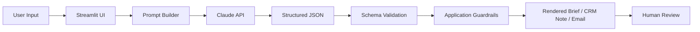

# MedTech Commercial Assistant

A portfolio project that uses the **Claude API** to support structured pre-call planning and post-call documentation for MedTech sales workflows.

## Why I built it

MedTech sales conversations often involve multiple stakeholders, evaluation processes, purchasing constraints, and follow-up actions. This project explores how generative AI can make that workflow more structured without allowing model-generated assumptions to quietly become account facts or seller commitments.

The goal is not to replace the salesperson. The goal is to make preparation and documentation more consistent while keeping a human reviewer responsible for the final CRM entry or customer communication.

## Features

### Pre-Call Prep
- Account snapshot
- Likely stakeholder roles
- Hypotheses to validate
- Discovery questions
- Call plan
- Risks and information gaps
- CRM-ready pre-call note
- Downloadable Markdown brief

### Post-Call Notes
- Call summary
- Stakeholders identified
- Needs and priorities
- Objections and blockers
- Documented seller commitments
- Recommended seller actions
- Customer actions
- Dates / timing
- CRM-ready post-call note
- Follow-up email
- Downloadable Markdown report

## Architecture



Claude is used for language understanding and generation. The application controls structure, validation, formatting, and selected guardrails.

## Design Decisions

A key design change happened during testing: prompt instructions alone did not reliably preserve the exact output structure. The project therefore moved from free-form Markdown generation to **structured JSON + application-side rendering**.

This prevents the model from silently renaming required sections and makes the workflow easier to test.

See [`DESIGN_DECISIONS.md`](DESIGN_DECISIONS.md) for more detail.

## Evaluation

The repository includes:
- deterministic unit tests for parsing, formatting, and guardrails
- a live Claude evaluation harness
- fictional edge cases for commitment inference, customer requests, timing, tentative trial interest, unnamed stakeholders, and unsupported clinical claims

See [`EVALUATION.md`](EVALUATION.md).

Release validation: **6/6 deterministic unit tests passed** and **20/20 live evaluation checks passed** using fictional test cases. Live evaluations consume the API credits of the person running them.

## Quick Copy

CRM notes and follow-up emails are rendered in wrapped code blocks. Streamlit provides a copy-to-clipboard icon in the upper-right of each block, so users do not need to resize or drag the output area.

## Error Handling

The application distinguishes:
- authentication errors
- API rate limits
- API connection errors
- API status errors

Where available, API request IDs are surfaced to make troubleshooting easier.

## Tech Stack
- Python
- Streamlit
- Anthropic Python SDK
- Claude API
- Pytest
- GitHub Actions

## Run Locally

```bash
python3 -m venv .venv
source .venv/bin/activate
pip install -r requirements.txt
streamlit run app.py
```

## Run Unit Tests

```bash
pip install -r requirements-dev.txt
pytest -q
```

## Run Live AI Evaluations

Set your Anthropic key locally:

```bash
export ANTHROPIC_API_KEY="your_key_here"
```

Then:

```bash
python evals/run_evals.py
```

To run one case:

```bash
python evals/run_evals.py --case request_is_not_commitment
```

Live evaluations use API credits.

## API Key Safety

This repository does **not** contain an Anthropic API key. The interactive Streamlit app requires each user to enter their own key and does not automatically use a server-side `ANTHROPIC_API_KEY`.

`.gitignore` excludes local secrets and development artifacts, including `.env`, `.env.*`, `.venv`, Streamlit secrets, logs, coverage files, and Python cache files. `.env.example` contains only a placeholder.

If this project is deployed publicly, do not modify it to automatically use a personal Anthropic API key for visitor requests unless authentication, rate limits, and usage controls are added. Otherwise, public traffic could create API charges on that account.

## Data Safety

Do not enter:
- protected health information (PHI)
- patient-identifiable information
- confidential customer data
- proprietary pricing
- contract information
- information you are not authorized to process

## Known Limitations

- The application does not connect directly to a CRM.
- It does not verify account facts against external sources.
- It does not perform clinical decision support.
- Model outputs can still be imperfect and require human review.
- The evaluation harness is a targeted behavioral test suite, not a guarantee of correctness.
- Public account research is intentionally excluded from this release until source verification and privacy controls are designed separately.

## Project Structure

```text
.
├── app.py
├── assistant_core.py
├── README.md
├── ARCHITECTURE.md
├── DESIGN_DECISIONS.md
├── EVALUATION.md
├── requirements.txt
├── requirements-dev.txt
├── evals/
│   ├── cases.json
│   └── run_evals.py
├── tests/
│   └── test_core.py
└── .github/
    └── workflows/
        └── tests.yml
```

## Author

**Bodhi Parks**

Built as a portfolio project at the intersection of MedTech commercialization and applied AI.


